# 软件与系统安全

## XSS攻击

### XSS攻击原理

XSS 即（Cross Site Scripting）中文名称为：跨站脚本攻击。

XSS的重点不在于跨站点，而在于脚本的执行。

XSS的原理是：
恶意攻击者在web页面中会插入一些恶意的script代码。当用户浏览该页面的时候，那么嵌入到web页面中script代码会执行，因此会达到恶意攻击用户的目的。那么XSS攻击最主要有如下分类：反射型、存储型、及 DOM-based型。 反射性和DOM-baseed型可以归类为非持久性XSS攻击。存储型可以归类为持久性XSS攻击。

### 反射性XSS

反射性XSS的原理是：反射性xss一般指攻击者通过特定的方式来诱惑受害者去访问一个包含恶意代码的URL。当受害者点击恶意链接url的时候，恶意代码会直接在受害者的主机上的浏览器执行。

反射型XSS的攻击步骤如下：

1. 攻击者在url后面的参数中加入恶意攻击代码。

2. 当用户打开带有恶意代码的URL的时候，网站服务端将恶意代码从URL中取出，拼接在html中并且返回给浏览器端。

3. 用户浏览器接收到响应后执行解析，其中的恶意代码也会被执行到。

4. 攻击者通过恶意代码来窃取到用户数据并发送到攻击者的网站。攻击者会获取到比如cookie等信息，然后使用该信息来冒充合法用户的行为，调用目标网站接口执行攻击等操作。

### 实验环境

- Apache 
- PHP

### 实验过程

- 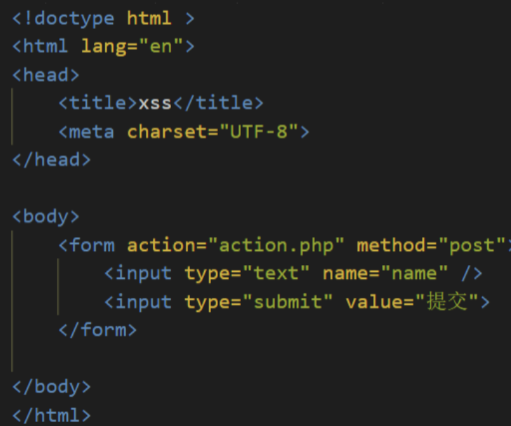

- 后端代码

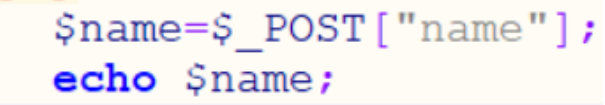

- 填写`<script>alert('hack')</script>`提交到后端，提示弹窗

  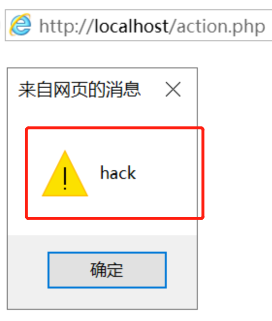

## 调用SQLite库WEB开发

### SQLite

SQLite是一个进程内的库，实现了自给自足的、无服务器的、零配置的、事务性的 SQL 数据库引擎。它是一个零配置的数据库不需要在系统中配置。SQLite 引擎不是一个独立的进程，可以按应用程序需求进行静态或动态连接。SQLite 直接访问其存储文件。

### 实验过程

- 建立数据库
  - `sqlite3 edu.db`
  - `create table studentsinfo(course_id INTEGER,student_id INTEGER,grades INTEGER);  `

- 修改httpserver.py代码,修改后代码如下

  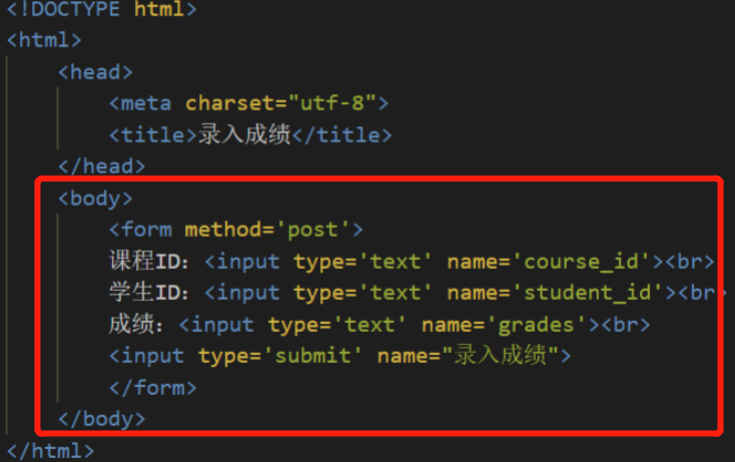

  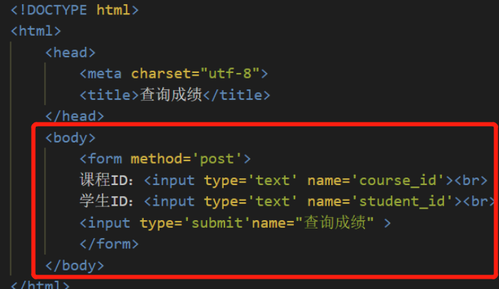

- 录入

  

- 查询

  

  

## SQL注入实验

### SQL注入

SQL注入是比较常见的网络攻击方式之一，它不是利用操作系统的BUG来实现攻击，而是针对程序员编写时的疏忽，通过SQL语句，实现无账号登录，甚至篡改数据库。

### sql_injection.py文件

sql_injection.py文件是一个独立的httpserver，其功能是输入学生ID，查询该学生ID的成绩。

sql_injection.py文件的漏洞为其SQL语句的编写，对用户输入的数据不经过过滤，就直接构造SQL语句进行查询。


例如在输入查询数值中插入一个`or 1=1`语句，则SQL语句查询变为了`SELECT *`

无条件查询。

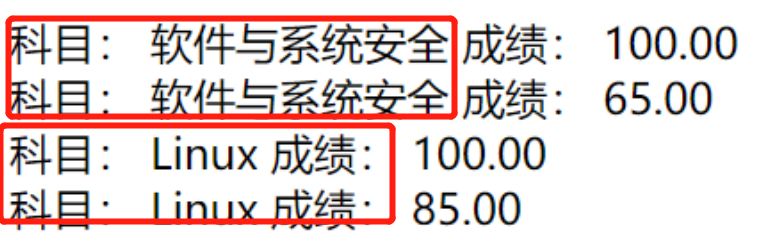

事实上，如果对输入数据不进行过滤，几乎可以通过插入SQL语句完成任何操作。

### 如何防御SQL注入

凡有SQL注入漏洞的程序，都是因为程序要接受来自客户端用户输入的变量或URL传递的参数，并且这个变量或参数是组成SQL语句的一部分，对于用户输入的内容或传递的参数，我们都应该采用**外部数据不可信任原则**，从变量的检测、过滤、验证下手，确保变量是符合规范的。

常用手段有：

- 检查变量数据类型和格式
- 过滤特殊符号
- 绑定变量，使用预编译语句

## 内存管理

* 以4MB（页）作为基本管理单元的虚拟内存管理。
* 虚拟内存管理是一套虚拟地址和物理地址对应的机制。
* 程序访问的内存都是虚拟内存地址，由CPU自动根据系统内核区中的地址对应关系表（分页表）来进行虚拟内存和物理内存地址的对应。
* 每个进程都有一个分页表。
* 每个进程都有一个完整的虚拟内存地址空间，x86情况下为4GB（0x00000000-0xffffffff）
* 但不是每个地址都可以使用（虚拟内存地址没有对应的物理内存）
* 使用VirtualAlloc API可以分配虚拟内存（以页为单位）、使用VirtualFree释放内存分页。
* 使用VirtualProtect 修改内存也保护属性（可读可写可执行）
* 数据执行保护（DEP）的基本原理
* malloc和free等C函数（也包括HeapAlloc和HeapFree等）管理的是堆内存，堆内存区只是全部内存区的一个部分。
* 堆内存管理是建立在虚拟内存管理的机制上的二次分配。
* 真正的地址有效还是无效是以分页为单位的。
* 内存分页可以直接映射到磁盘文件（FileMapping）、系统内核有内存分页是映射物理内存还是映射磁盘文件的内存交换机制。
* 完成内存分页管理的相关实验

### 实验观察

```
int main() 
{
 char* a = malloc(100);
 a[101] = 'a';}
```

为变量分配了100个字节的内存单位。在写入的时候，超出两个字节，代码执行时不会出现异常情况程序能够正常退出。

这种状况是因为操作系统对内存的管理是有开销的。系统本身需要在单独的内存中记录内存块是否可用。如果记录内存是否可用这个信息太细，那么记录所有的内存开销就很高。为了减少记录开销，系统采用4KB为单位管理内存分配，所以事实上我们分配的100B位于系统分配的4KB中，所以能够正常运行。

malloc被称为堆内存管理。malloc可以分配任意大小的数据，但是malloc并不关心一块数据是否有效的问题，而是由更底层的虚拟内存管理来进行的，一个4KB的内存管理单元，我们称为一个内存分页。当malloc在内存分配时，如果已经可用的分页中，还有剩余的空间足够用，那么malloc就在这个可用的分页中拿出需要的内存空间返回地址。如果已经可用的分页不够用，再去分配新的分页，然后返回可用的地址。所以malloc分配可以比较灵活，但实际上系统底层的内存是分块分配的。

打开任务管理-详细信息页面就能够看到分配的内存都是4KB的倍数值。

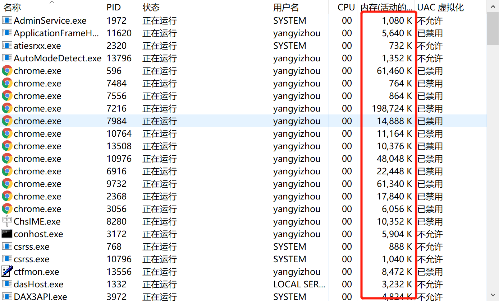

**得到结果都表明了windows内存管理采用分页机制，并且默认情况页面大小为4KB。**

## 内存实验

* 阅读VirtualAlloc、VirtualFree、VirtualProtect等函数的官方文档。
* 编程使用malloc分配一段内存，测试是否这段内存所在的整个4KB都可以写入读取。
* 使用VirtualAlloc分配一段，可读可写的内存，写入内存，然后将这段内存改为只读，再读数据和写数据，看是否会有异常情况。然后VirtualFree这段内存，再测试对这段内存的读写释放正常。

### 实验过程

- 编程使用malloc分配一段内存，测试是否这段内存所在的整个4KB都可以写入读取

  - c语言中char型占1字节，4KB是4096个字节  

  - test=4096，即4KB空间都可以进行读取  

    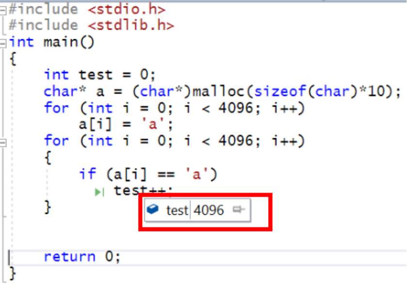

- （二）使用VirtualAlloc分配一段，可读可写的内存，写入内存，然后将这段内存改为只读，再读数据和写数据，看是否会有异常情况。然后VirtualFree这段内存，再测试对这段内存的读写释放正常

  - 使用VirtualAlloc分配一段，可读可写的内存

  - 申请-提交-写入-释放内存

  ```c++
  void MemoryStatus()
      {
      	MEMORYSTATU SmemStatus;
      	GlobalMemoryStatus(&memStatus);
      	cout << "内存初始状态：" << endl;
      	cout << "内存繁忙程度=" << memStatus.dwMemoryLoad << endl;
      	cout << "总物理内存=" << memStatus.dwTotalPhys << endl;
      	cout << "可用物理内存=" << memStatus.dwAvailPhys << endl;
      	cout << "总页文件=" << memStatus.dwTotalPageFile << endl;
      	cout << "可用页文件=" << memStatus.dwAvailPageFile << endl;
      	cout << "总进程空间=" << memStatus.dwTotalVirtual << endl;
      	cout << "可用进程空间=" << memStatus.dwAvailVirtual << endl;
      }
  ```

  ```c++
  int main()
      {
      	cout << "初始状态：" << endl;
      	MemoryStatus();
      	//申请内存
      	char* lpv = (char*)VirtualAlloc(NULL, 1024 * 1024 * 1024, MEM_RESERVE,PAGE_READWRITE);
      	cout << "申请内存后：" << endl;
      	MemoryStatus();
      	//提交内存
      	lpv = (char*)VirtualAlloc(lpv, 1024 * 1024 * 1024, MEM_COMMIT,PAGE_READWRITE);
      	cout << "提交内存后：" << endl;
      	MemoryStatus();
      	//使用内存
      	strcpy(lpv, "abc");
      	cout << "使用内存后：" << endl;
      	MemoryStatus();
      	//释放内存
      	VirtualFree(lpv, 1024 * 1024 * 1024, MEM_RELEASE);
      	system("pause");
      	return 0;
      }
  ```

  - 结果表明由 VirtualAlloc 分配的内存可以正常的写入和读取      

- 使用 VirtualProtect 修改一段内存的访问属性

  * 函数：VirtualProtect (PVOID 基地址，SIZE_T 大小，DWORD 新属性，DWORD 旧属性)

    ```c
    vp = VirtualProtect(
      lpv,
      PAGELIMIT * dwPageSize,	 // 需要改变访问属性的区域大小
      PAGE_READONLY,           // 只读
      &oldProtect	             // 在修改前，旧的访问属性将被存储
    );
    ```

    

  * 更改一页的页面属性，改为只读后无法访问，还原后可以访问

    ```c
    DWORD protect;
    iP[0]=8;
    VirtualProtect(lpv,4096,PAGE_READONLY,&protect);
    int * iP=(int*)pV;
    iP[1024]=9;                //可以访问，因为在那一页之外
                               //iP[0]=9;不可以访问，只读
    //还原保护属性
    VirtualProtect(lpv,4096,PAGE_READWRITE,&protect);
    cout<<"初始值="<<iP[0]<<endl;    //可以访问
    ```

    * 结果：将访问属性修改为 PAGE_READONLY 后，该段内存无法写入，但可以正常读取

   * 释放内存代码

    ```c
    //只释放物理内存
    VirtualFree((int*)pV+2000,50*1024*1024,MEM_DECOMMIT);
    int* a=(int*)pV;
    a[10]=2;//可以使用，没有释放这一页
    MEMORYSTATUS memStatusVirtual3;
    GlobalMemoryStatus(&memStatusVirtual3);
    cout<<"物理内存释放："<<endl;
    cout<<"增加物理内存="<<memStatusVirtual3.dwAvailPhys-memStatusVirtual2.dwAvailPhys<<endl;
    cout<<"增加可用页文件="<<memStatusVirtual3.dwAvailPageFile-memStatusVirtual2.dwAvailPageFile<<endl;
    cout<<"增加可用进程空间="<<memStatusVirtual3.dwAvailVirtual-memStatusVirtual2.dwAvailVirtual<<endl<<endl;
    ```

  - 结果：内存释放后将无法读取和写入

## 内存保护

### 内存地址有效性

- 在溢出性漏洞攻击中，攻击程序的编写需要考虑内存地址的有效性，如果访问不可用内存则会引起程序系统的崩溃，需要访问可用内存才能够驻留系统，实现攻击。
- 应用程序所用的地址是虚拟地址，不是物理地址。

### 页表结构

页表是一种特殊的数据结构，放在系统空间的页表区，存放逻辑页与物理页帧的对应关系。 每一个进程都拥有一个自己的页表，PCB表中有指针指向页表。其作用是实现从页号到物理块号的地址映射。

例如32位系统中，地址空间从0x0-0xFFFFFFFF，一共4GB可用，表示一个进程可用4GB内存。进程使用不到4GB时，系统仅当进程需要使用时才把内存分页的地址映射到物理地址上，进程使用超过4GB时，系统则会通过分页交换把暂时不用的内存缓存到硬盘中。

### 实验要求

* 【1】验证不同进程的相同的地址可以保存不同的数据。
  * 在VS中，设置固定基地址，编写两个不同可执行文件。同时运行这两个文件。然后使用调试器附加到两个程序的进程，查看内存，看两个程序是否使用了相同的内存地址。
  * 在不同的进程中，尝试使用VirtualAlloc分配一块相同地址的内存，写入不同的数据。再读出。
* 【2】配置一个Windbg双机内核调试环境，查阅Windbg的文档，了解:
  * Windbg如何在内核调试情况下看物理内存，也就是通过物理地址访问内存
  * 如何查看进程的虚拟内存分页表，在分页表中找到物理内存和虚拟内存的对应关系，然后通过Windbg的物理内存查看方式和虚拟内存的查看方式，看同一块物理内存中的数据情况。
    * 首先需要搭建Windbg的内核调试环境。由于我们直接调试的操作系统内核，所以需要两台计算机安装两个Windows，然后连个计算机使用串口进行链接。
    * 所以我们需要再虚拟机中安装一个Windows，然后通过虚拟串口和host pipe链接的方式，让被调试系统和windbg链接，windbg可以调试。


在VS中，设置固定基地址，编写两个不同可执行文件，同时运行这两个文件。使用调试器附加到两个程序的进程，查看内存，查看两个程序是否使用了相同的内存地址；

- 测试代码

```C
//test1
#include<stdio.h>
int main()
{
	printf("test 1");
}

//test2
#include<stdio.h>
int main()
{
	printf("test 2");
}
```

- 设置基地址

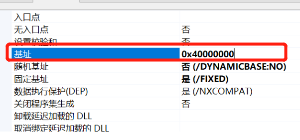

- 查看进程内存地址

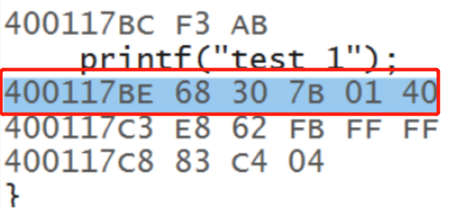

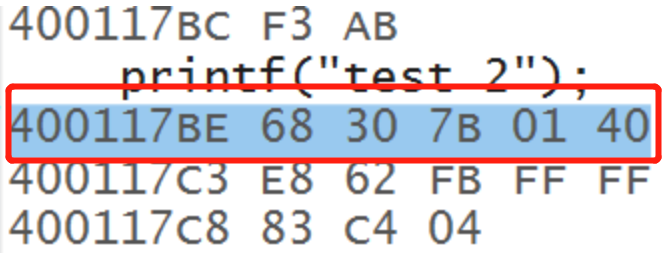

在不同的进程中，尝试使用VirtualAlloc分配一块相同地址的内存，写入不同的数据再读出.

- 工程1

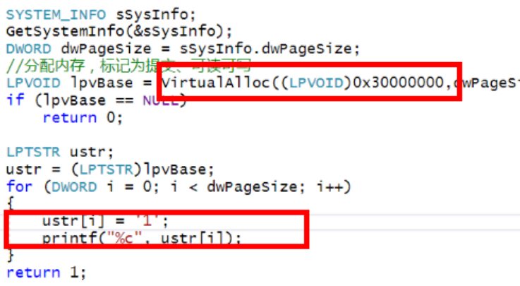

- 工程2

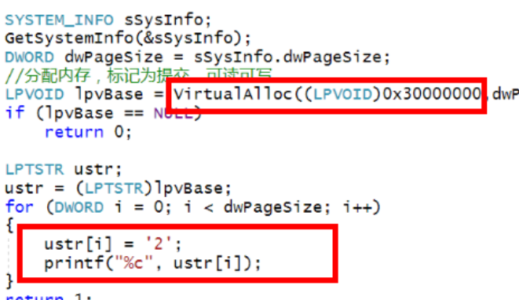

- 查看内存

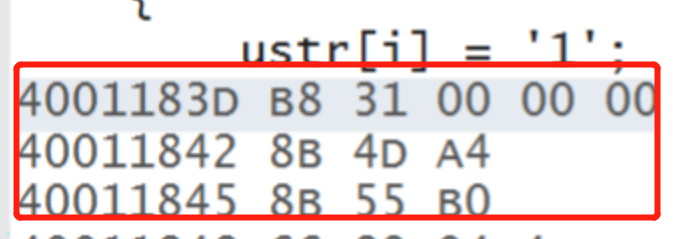

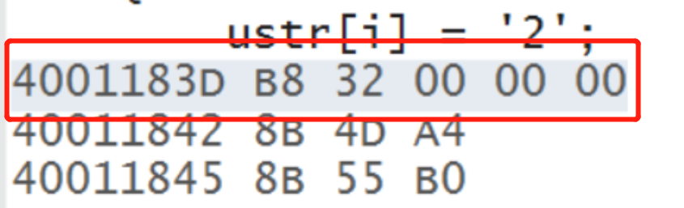

**可以发现相同的内存存入了不同的数据，为内存保护**

## Shellcode

### shellcode

shellcode是一段用于利用软件漏洞而执行的代码，shellcode为16进制的机器码，因为经常让攻击者获得shell而得名。shellcode常常使用机器语言编写。 可在暂存器eip溢出后，塞入一段可让CPU执行的shellcode机器码，让电脑可以执行攻击者的任意指令。

### 作业要求

* 详细阅读 www.exploit-db.com 中的shellcode。建议找不同功能的，不同平台的 3-4个shellcode解读。
* 修改示例代码的shellcode，将其功能改为下载执行。也就是从网络中下载一个程序，然后运行下载的这个程序。提示：Windows系统中最简单的下载一个文件的API是 UrlDownlaodToFileA
  - 其中第二个作业，原参考代码只调用了一个API函数，作业要求调用更多的API函数了，其中涉及到的参数也更复杂，但是原理是相通的。URLDownloadToFileA函数在 Urlmon.dll 这个dll中，这个dll不是默认加载的，所以可能还需要调用LoadLibrary函数
  - [Windows/x64 - Download File (http://192.168.10.129/pl.exe) + Execute (C:/Users/Public/p.exe) Shellcode (358 bytes)](https://www.exploit-db.com/shellcodes/40821)
  - [Windows/x64 (XP) - Download File + Execute Shellcode Using Powershell (Generator)](https://www.exploit-db.com/shellcodes/36411) 

### 实验过程

- 实现运行计算器

  ```c
  #include <windows.h>
  #include <stdio.h>
  char code[] = \
  "\x89\xe5\x83\xec\x20\x31\xdb\x64\x8b\x5b\x30\x8b\x5b\x0c\x8b\x5b"
  "\x1c\x8b\x1b\x8b\x1b\x8b\x43\x08\x89\x45\xfc\x8b\x58\x3c\x01\xc3"
  "\x8b\x5b\x78\x01\xc3\x8b\x7b\x20\x01\xc7\x89\x7d\xf8\x8b\x4b\x24"
  "\x01\xc1\x89\x4d\xf4\x8b\x53\x1c\x01\xc2\x89\x55\xf0\x8b\x53\x14"
  "\x89\x55\xec\xeb\x32\x31\xc0\x8b\x55\xec\x8b\x7d\xf8\x8b\x75\x18"
  "\x31\xc9\xfc\x8b\x3c\x87\x03\x7d\xfc\x66\x83\xc1\x08\xf3\xa6\x74"
  "\x05\x40\x39\xd0\x72\xe4\x8b\x4d\xf4\x8b\x55\xf0\x66\x8b\x04\x41"
  "\x8b\x04\x82\x03\x45\xfc\xc3\xba\x78\x78\x65\x63\xc1\xea\x08\x52"
  "\x68\x57\x69\x6e\x45\x89\x65\x18\xe8\xb8\xff\xff\xff\x31\xc9\x51"
  "\x68\x2e\x65\x78\x65\x68\x63\x61\x6c\x63\x89\xe3\x41\x51\x53\xff"
  "\xd0\x31\xc9\xb9\x01\x65\x73\x73\xc1\xe9\x08\x51\x68\x50\x72\x6f"
  "\x63\x68\x45\x78\x69\x74\x89\x65\x18\xe8\x87\xff\xff\xff\x31\xd2"
  "\x52\xff\xd0";
  
  int main(int argc, char** argv) //运行上面的code
  {
      int (*func)();
      func = (int(*)()) code;
      (int)(*func)();
  }
  ```

  

- 结果

  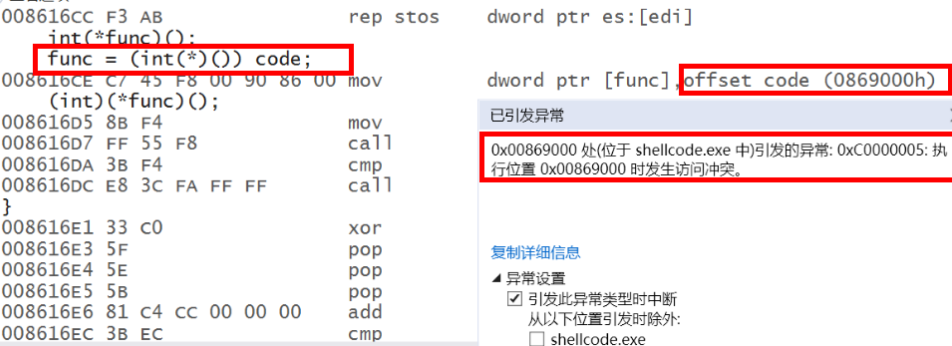

- 分析

  * `0x00869000 ` 就是code的第一个字节的位置。
  * 在运行 (int)(*func)() 时出错的。
  * 这一句调用 func执行，而现在func是指向code的，也就是func的值是code的内存地址。因为它是全局变量，在程序运行起来后，就存在内存中，是进程的初始化过程就完成了内存分配，并由进程初始化程序从可执行文件中直接载入内存的。全局变量，肯定是有效地址，是可以访问的。由于code是全局变量，是数据，通常情况下，会给数据设置可读和可写的内存保护属性，但是一般不会给执行属性。但是我们要去执行它，所以可能引发了异常。

- 解决办法：VirtualProtect修改内存保护属性

  * PAGE_EXECUTE_READWRITE 表示这段内存，是可读可写可执行

  ```c
   int main(int argc, char** argv)
  {
     int (*func)();
     DWORD dwOldProtect;
     func = (int(*)()) code;
     VirtualProtect(func, sizeof(code),PAGE_EXECUTE_READWRITE, &dwOldProtect);
     (int)(*func)();
  }
  ```

- 执行成功，运行计算器

  

## Fuzzing

### 课堂知识
### 基础知识
* Fuzzing目前也是漏洞挖掘的主要方法之一，是各种漏洞挖掘技术中人力消耗比较低，技术门槛比较低，同时效果却比较好的一种方法。其他的方法，比如程序分析、符号执行等也人在用。但是难度相对较大一些。
* 首先，第一个我们需要确定一个目标。你对什么软件进行漏洞挖掘，软件是做什么的。数据来源是文件还是网络，或者既有文件又有网络。因为我们知道Fuzzing的主要原理就是随机性的大量给被测试软件输入数据。当然首先就需要知道软件是处理什么样的数据的，应该如何给软件输入数据。
* 一般来讲，现在主要就是文件和网络两种。如果是文件型的，最典型的比如Word。那么我们就需要构造大量的文件。如果是网络的，比如一个Web服务器，那么我们就需要构造大量的网络数据包发送给被测试软件。我们一般称为文件型Fuzzing和网络型Fuzzing
* 选定了被测试软件以后，下面就需要构造软件的运行环境。如果是Windows Linux的应用软件，可以直接运行。如果是手机软件，由于手机自带的调试功能比较弱，比方便控制和输入，一般可能需要一个模拟器来运行。
* 有了运行环境以后，下一步，需要选择一个Fuzzing的框架。Fuzzing技术发展了很多年，有很多人已经开发了不少框架。框架已经解决了Fuzzing测试中的一些基本的共性的问题，我们不需要重头开始做。在框架的基础上，我们只需要进行一些配置或者少量的编程就可以开始进行测试了。
* 然后，我们需要选择一种策略。比如是基于生成的还是基于变异的。那什么是基于生成的呢，就是我们的数据完全是重新构造的，不基于一些已有的数据或者模板。当然重新构造的过程中，也不能完全瞎构造，通常有效的测试数据并不是完全畸形的数据，而是半畸形数据。因为完全畸形的数据，可能在到达测试对象之前就已经被丢弃了。比如一个网络数据包，如果不符合数据包的基本格式。连IP地址都不对。那肯定是到不了被测试对象的。所以基于生成的，也需要在规则、协议、文件格式的基础上进行。所以基于生成的策略，一般只对协议已知、格式开放的目标。那么一些位置协议或者格式不清楚的数据，就可以采用基于变异的策略。在已有的合法数据基础上，通过一定的随机性的变化来得到测试数据。已有的合法数据比较容易得到，比如很多年前，Word没有开放doc文件的格式。如果我们要对Word进行Fuzzing，就应该采取基于变异的策略。用Word先保存生产一个合法的doc文件，再在这个合法的doc文件的基础上大量变异，也就是随机性的替换一些数据、插入删除一些片段数据来得到大量的测试数据。同样，如果是对网络程序进行Fuzzing。我们可以让网络程序先正常运行，抓取数据包。然后对抓取的数据包进行重放，重放过程中进行一定比例的变异（随机性的替换、插入、删除）。
* 总之，模糊测试技术是一种通过注入缺陷实现的自动化软件测试技术。其基础是在执行时将包括无效的、意外的或随机的数据输入注入到程序中，监视程序是否出现崩溃等异常，以获取意外行为并识别潜在漏洞。模糊测试的重点在于输入用例的构造。测试用例的生成方式可基于生成或基于变异。基于生成的模糊测试(Smart Fuzzing)首先对目标程序进行分析，尽可能收集有关它的信息，基于这些信息生成测试数据。此技术基于前期大量分析构造有效的测试数据，自动化程度相对较低。基于变异的模糊测试(Dumb Fuzzing)根据一定的规则对现有的样本数据进行修改并生成模糊测试用例。该生成方法简单，但是并未考虑程序自身的特点，因此生成测试用例有效性较低，漏报率高。但是模糊测试在一定程度上降低了安全性测试的门槛，原理简单，一般不会误报。但是对目标对象知识的获取程度直接影响模糊测试的效果。而且，模糊测试技术无法检测所有漏洞。

**对家用路由器采用Fuzzing技术进行漏洞挖掘**

* 首先，需要了解到，这种路由器，其实是硬件和软件一体的一个小型的设备。它的架构和我们的电脑、手机其实有相同的地方。它也有CPU、内部有操作系统、在操作系统中还有少量的应用软件，来实现路由器的一些功能。不同的是，这种小型路由器一般是MIPS架构的CPU，我们的电脑一般是intel架构的CPU(x86 x64)，Intel架构的CPU既包括Intel生成的CPU也包括AMD公司生产的CPU。我们的手机都是ARM架构的CPU。这几种架构各有特点。MIPS适合小型化设备，功耗低性能弱、价格便宜，结构简单。ARM适合中型一些的设备，体积小能耗小功能适合手机，但是价格比较高。x86_64适合电脑和服务器，能耗高（发热也就高）、性能最高，价格最贵，结构最复杂。当然这几种CPU架构，他们的指令集是不一样的，所以有各自的汇编语言，也有各自的编译器工具链。我们知道，手机操作系统并不能运行在PC上。
* 同样这种路由器的操作系统，也无法直接运行在PC上。所以前期有一些环境搭建的工作。需要把路由器的系统运行在模拟器中。QEMU就是中场景下广泛使用的模拟器。所以如果进行家用路由器的漏洞挖掘，首先第一步可能是安装 [QEMU](https://www.qemu.org/)       
* QEMU的基本原理是模拟各种CPU的执行环境，用软件来实现CPU的硬件功能并封闭出来执行的环境。使用QEMU可以跨平台运行系统和软件。在软件开发和调试中应用非常广泛。比如我们开发手机APP，安卓系统的调试模拟环境就是基于QEMU的。但是由于后面我们还有其他工具大多时运行在Linux系统中的，所以我们的Fuzzing实验可能需要再Linux系统中进行。
* 有了第一步，执行环境有了。第二步，我们需要把我的目标程序在执行环境中运行。路由器的操作系统和整个应用软件，是植入到路由器的存储器中的。就像我们的PC中的系统和软件安装在硬盘上一样。由于路由器功能单一，系统不大，所以一般将操作系统和应用程序打包成一个镜像文件。称为固件,Firmware。如果有了固件，就可以在模拟器中运行整个路由器了。所以路由器这种东西也是分为硬件和软件的，其bug和漏洞也主要是出现在软件中，硬件中的问题，我们一般不考虑。软件都位于固件中。固件的主体是一个裁剪过的微型Linux系统。然后在这个系统至少运行一些实现路由器功能的应用程序。比如会有实现路由协议的实现包转发的程序、有实现用户配置的程序（一般是一个Web服务器）、有实现内网地址分发的DHCP的程序等。
* 要得到固件，有两种办法。一种是直接从路由器中提取。一种是从官方网站上下载一个固件。路由器中当然是有固件的，否则它不能运行。厂家的官方网站有时候会开放固件供下载，因为有一些用户有升级固件的需求，比如上一个版本的固件中发现了bug，厂家就会在网站上发布一个新的固件，让用户在配置界面中升级。虽然对大多数用户不会去升级路由器的固件。但是负责任的厂家有更新的义务。不过既然绝大部分不更新，也不会更新，所以也有一些厂家不提供。那么如果有有固件的，我们可以直接下载，没有的，就需要提取。提取固件，也有现成的工具，比如binwalk。
* 提取以后的固件使用QEMU加载运行.使用qemu-arm-static运行提取的固件                              
* 有一些下载的固件或者固件内部的部分软件是源代码形式的。所以可能还需要编译一下。这里的编译和我们之前用过的编译不同。称为交叉编译。我们以前在一个x86架构下的PC中，编译一个本架构下的软件，编译后在本机运行。而交叉编译是编译一个在其他系统中运行的软件，比如在x86系统中编译一个MIPS架构的软件。由于MIPS架构的主机一般性能不高，软件环境单一，所以通常不作为工作环境，也跑不起来编译器。所以我们在PC上进行编译发布在响应环境中运行。这种称为交叉编译。mips-gcc 和 mipsel-gcc 编译器就是交叉编译器。所以，在实验过程中，根据情况，可能还有其他的支撑工具需要使用。
* 搭建好环境以后，系统和应用已经运行起来。下一步，就可以使用Fuzzing测试工具进行测试了。前面说，Fuzzing已经有一些框架可以使用了。SPIKE、AFL、Sulley、BooFuzz
  * Boofuzz是Sulley的继承与完善。Boofuzz框架主要包括四个部分：
    * 数据生成，根据协议原语构造请求。
    * 会话管理或驱动，将请求以图的形式链接起来形成会话，同时管理待测目标、代理、请 * 还提供一个Web界面用于监视和控制检测、跟踪并可以分类检测到的故障。
    * 通过代理与目标进行交互以实现日志记录、对网络流量进行监控功能等。
    * 有独立的命令行工具，可以完成一些其他的功能。
  * 使用Boofuzz对模拟器环境中的路由器程序进行测试主要步骤为：
    1. 根据网络请求数据包构造测试用例请求；
    2. 设置会话信息(目标IP、端口号等)，然后按照请求的先后顺序将其链接起来；
    3. 添加对目标设备的监控和重启机制等；
    4. 开始测试。
*******************************
### 实验要求
* 搜集市面上主要的路由器厂家、在厂家的官网中寻找可下载的固件。在CVE漏洞数据中查找主要的家用路由器厂家的已经公开的漏洞，选择一两个能下载到切有已经公开漏洞的固件。如果能下载对应版本的固件，在QEMU中模拟运行。确定攻击面（对哪个端口那个协议进行Fuzzing测试），尽可能多的抓取攻击面正常的数据包（wireshark）。
* 查阅BooFuzz的文档，编写这对这个攻击面，这个协议的脚本，进行Fuzzing。
* 配置BooFuzz QEMU的崩溃异常检测，争取触发一次固件崩溃，获得崩溃相关的输入测试样本和日志。尝试使用调试器和IDA-pro监视目标程序的崩溃过程，分析原理。
*******************************
### 实验环境
* 虚拟机：Ubuntu16.04 desktop
* [DLink RCE漏洞CVE-2019-17621分析](https://www.freebuf.com/vuls/228726.html)
*******************************
### 实验过程
### 环境准备  
* 安装QEMU
  ```bash
  sudo apt-get install zlib1g-dev
  sudo apt-get install libglib2.0-0
  sudo apt-get install libglib2.0-dev
  sudo apt-get install libtool
  sudo apt-get install libsdl1.2-dev
  sudo apt-get install libpixman-1-dev
  sudo apt-get install autoconf
  sudo apt-get install qemu
  sudo apt-get install qemu-user-static
  sudo apt-get install qemu-system
  ```
  * 用`qemu-img --version`查看qemu版本，确保安装成功      

* 安装 binwalk
  ```bash
  sudo apt-get install python-lzma
  sudo apt-get install build-essential autoconf git
  git clone https://github.com/devttys0/binwalk
  ```
  ```bash
cd binwalk  
  sudo python setup.py install
  ```
  
* 从[站点](https://people.debian.org/~aurel32/qemu/mips/)下载debianmips qemu镜像，由于虚拟机是Ubuntu linux，下载debian_squeeze_mips_standard.qcow2和vmlinux-2.6.32-5-4kc-malta即可：
    ```
    wget https://people.debian.org/~aurel32/qemu/mips/debian_squeeze_mips_standard.qcow2
    wget https://people.debian.org/~aurel32/qemu/mips/vmlinux-2.6.32-5-4kc-malta
    ```
    
* MIPS系统网络配置
  * 使用QEMU 模拟运行MIPS系统，需要将ubuntu虚拟机设置成桥接，这样以来ubuntu系统就可以和QEMU虚拟机进行通信和数据传输。                     
  * 获取安装依赖，执行以下命令：
    ```bash
    sudo apt-get install bridge-utils uml-utilities
    ```
  * 修改ubuntu主机网络配置，修改ubuntu的网络接口配置文件
    ```bash
    sudo vim /etc/network/interfaces

    auto lo
    iface lo inet loopback

    auto ens33
    iface ens33 inet manual
 
    auto br0
    iface br0 inet dhcp
    bridge_ports ens33
    bridge_maxwait 0
    ```
  * 修改QEMU的网络接口启动脚本，重启网络使配置生效，执行以下命令：
    ```bash
    sudo vim /etc/qemu-ifup
    #在脚本文件/etc/qemu-ifup结尾增加如下内容：
    #!/bin/sh
    echo "Executing /etc/qemu-ifup"
    echo "Bringing $1 for bridged mode..."
    sudo /sbin/ifconfig $1 0.0.0.0 promisc up
    echo "Adding $1 to br0..."
    sudo /sbin/brctl addif br0 $1
    sleep 3
    ```
    ​                                         
  * 保存文件/etc/qemu-ifup 以后，赋予可执行权限，然后重启网络使所有的配置生效：
    ```bash
    sudo chmod a+x /etc/qemu-ifup
    sudo /etc/init.d/networking restart
    ```
    ​    
  
* QEMU启动配置
  * Qemu运行之前先启动桥接网络，在本地ubuntu命令行终端执行以下命令 
    ```
    sudo ifdown ens33
    sudo ifup br0 
    ```
  
* QEMU MIPS虚拟机启动
  * 进入前面下载的mips镜像目录，执行以下命令：
    ```
    sudo qemu-system-mips -M malta -kernel vmlinux-2.6.32-5-4kc-malta -hda debian_squeeze_mips_standard.qcow2 -append "root=/dev/sda1 console=tty0" -net nic,macaddr=00:16:3e:00:00:01 -net tap
    ```
  * 输入root/root便可登入qemu mips虚拟机   
  
* 固件模拟运行
  * 从DLink官网下载[包含漏洞版本的路由器固件](ftp://ftp2.dlink.com/PRODUCTS/DIR-859/DIR-859_REVA_FIRMWARE_v1.05B03.zip)    
    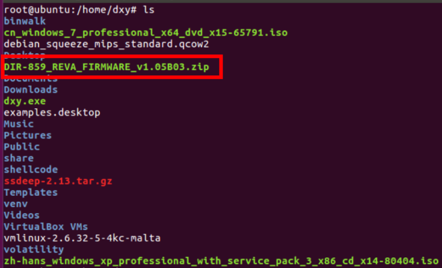
  * 使用binwalk直接解压固件可得到文件系统文件：   
    ```
    binwalk DIR-859_REVA_FIRMWARE_v1.05B03.zip
    ```
        
  * 固件模拟运行由两种方式可以考虑：
    * 1、将文件系统上传到qemu mips虚拟机中运行
    * 2、借助firmadyne工具运行固件
  * 这里选用第二种方法，借助firmadyne工具运行固件

    * Firmadyne 是一款自动化和可裁剪的嵌入式 Linux 系统固件分析框架，它支持系统固件逆向 QEMU 嵌入式系统模拟执行，使用其可模拟路由器固件、执行路由器。
    * 注意：Firmadyne 安装之前，先安装 firmware-analysis-toolkit，安装完成之后在 firmware-analysis-toolkit 目录中创建 firmadyne 目录并下载安装 Firmadyne。各自全部安装完成后如下所示（注意两个工具须完全按照步骤安装完成，否则后续固件运行会出错）：
     ```bash
     git clone --recursive https://github.com/attify/firmware-analysis-toolkit.git
     ```
    
  + 进入Firmadyne目录，下载Firmadyne。然后打开`firmadyne.config`，修改 FIRMWARE_DIR的路径为当前Firmadyne目录的绝对路径
    ```bash
    git clone https://github.com/firmadyne/firmadyne
    cd firmware-analysis-toolkit/firmadyne
  
    vim firmadyne.config
    # 以下为firmadyne.config中的内容
    FIRMWARE_DIR=/home/dxy/firmware-analysis-toolkit/firmadyne/
    ```
    
  * 安装Firmadyne
    ```bash
    sh ./download.sh
    sudo ./setup.sh 
    ```
    * 安装 Firmadyne 需要的其他环境，包括 QEMU
     ```bash
     sudo -H pip install git+https://github.com/ahupp/python-magic
     sudo -H pip install git+https://github.com/sviehb/jefferson
     sudo apt-get install qemu-system-arm qemu-system-mips qemu-system-x86 qemu-utils
     ```
  * 安装postgresql数据库
    ```bash
    sudo apt-get install postgresql
    #用户的用户名和密码设置为：firmadyne
    sudo -u postgres createuser -P firmadyne
    sudo -u postgres createdb -O firmadyne firmware
  
    # 注意这里的数据库文件是在firmadyne/目录下，也就是该命令要在根目录firmware-analysis-toolkit/目录下执行
  sudo -u postgres psql -d firmware < ./firmadyne/database/schema
    ```
  * 启动postgresql数据库
    ```bash
    sudo service postgresql start
    sudo service postgresql status     
    ```
  * 运行
    * 将 firmware-analysis-toolkit 目录下的 fat.py 和 reset.py 文件移动到 firmadyne 目录    
    * 修改fat.py中的执行权限、firmadyne的路径`firmadyne_path`以及root密码`root_pass`
      ```bash
      chmod +x fat.py
  
      vim fat.py
      #Configurations - change this according to your system
      firmadyne_path = "/home/dxy/firmware-analysis-toolkit/firmadyne"
      binwalk_path = "/usr/local/bin/binwalk"
      root_pass = "19990411"
      firmadyne_pass = "firmadyne"
      ```
            
    * 执行以下命令
      ```bash
      rm -rf images*
      python3 reset.py
      ./sources/extractor/extractor.py -b Dlink -sql 127.0.0.1 -np -nk "DIR-859_REVA_FIRMWARE_v1.05B03.zip" images
      ./scripts/getArch.sh ./images/1.tar.gz
      ./scripts/makeImage.sh 1
      ./scripts/inferNetwork.sh 1
      ./scratch/1/run.sh 
      ```
    * 看到（'br0','192.168.0.1')
    
    * Ubuntu中打开浏览器，输入192.168.0.1即可访问仿真路由器：
         
  
  ## 

## klee-tutorials

### 实验要求
* 安装KLEE，完成[官方tutorials](https://klee.github.io/tutorials/testing-function/)至少前三个

### 实验环境：ubuntu server （VM虚拟机）

### 实验准备
* 安装docker 
  ```bash
    #更新apt包索引：
    $ sudo apt-get update
    #安装以下包以使apt可以通过HTTPS使用存储库（repository）：
    $ sudo apt-get install -y apt-transport-https ca-certificates curl software-properties-common
    #添加Docker官方的GPG密钥：
    $ curl -fsSL https://download.docker.com/linux/ubuntu/gpg | sudo apt-key add -
    #使用下面的命令来设置stable存储库：
    $ sudo add-apt-repository "deb [arch=amd64] https://download.docker.com/linux/ubuntu $(lsb_release -cs) stable"
    #再更新一下apt包索引：
    $ sudo apt-get update
    #安装最新版本的Docker CE：（需要一定时间）
    $ sudo apt-get install -y docker-ce
  ```
* 查看docker服务是否启动：$ systemctl status docker 
    
* 在docker中安装klee
    ```bash
    # 安装 KLEE
    docker pull klee/klee:2.0
    ```
* 重启服务

    ```bash
    systemctl daemon-reload
    systemctl restart docker
    ```
       

* 创建KLEE Docker容器的几种方法
    ```bash
    # 创建一个临时容器 一次性的
    docker run --rm -ti --ulimit='stack=-1:-1' klee/klee:2.0
    # 创建一个长期容器，名为klee_dxy
    sudo docker run -ti --name=klee_dxy --ulimit='stack=-1:-1' klee/klee
    # 退出后可通过名字再次进入
    sudo docker start -ai klee_dxy
    # 删除长期容器
    docker rm klee_dxy
    ```

### 实验过程

**Tutorial 1: Testing a small function.**

  + 运行 tutorial
  ```bash
   # 创建一个临时容器(为了测试实验用)
    docker run --rm -ti --ulimit='stack=-1:-1' klee/klee:2.0
  ```
    
  + 示例代码`get_sign.c`在 `/klee_src/examples/get_sign` 目录下，用来判断一个整数的正，负，或者为0.
    ```c
    #include <klee/klee.h>
    int get_sign(int x) {
      if (x == 0)
         return 0;
      if (x < 0)
         return -1;
      else 
         return 1;
    } 
    int main() {
      int a;
      klee_make_symbolic(&a, sizeof(a), "a");
      return get_sign(a);
    }
    ```
        
  + klee_make_sybolic是KLEE自带的函数，用来产生符号化的输入。因为KLEE是在LLVM字节码上进行工作，所以我们首先需要将.c编译为LLVM字节码.执行命令:
    ```bash
    clang -I ../../include -emit-llvm -c -g -O0 -Xclang -disable-O0-optnone get_sign.c
    ```
  * 上一步执行完成后，再同目录下会生成一个get-sign.bc的字节码文件     
       
  * KLEE跑起来 `klee get_sign.bc`
    * 结果中KLEE给出了总指令数，完整路径和生成的测试案例数。
       
  + 当前目录下多生成了两个文件：klee-last 和 klee-out-0
    * 其中klee-out-0是本次测试结果
    * klee-last是最新测试结果   
         
  * 函数有3条路径，a等于0，a小于0，a大于0。每一条路径都生成了一个测试例。
  * 对于探索的每条道路，KLEE执行的输出是一个目录（在本例中为klee-out-0），其中包含KLEE生成的测试用例
       
  * KLEE生成的测试用例被写入扩展名为.ktest的文件中。这些是二进制文件，可以使用ktest-tool实用程序读取
    * 可见每一个测试文件包括调用的参数、符号对象、路径的数量(1)、象征性的对象的名字(a)、它的大小(4)  
    * 第一个测试为0，第二个测试为16843009，最后一个测试为-2147483648。
    * KLEE生成了值0，一个正值（16843009）和一个负值（-2147483648）  
       

****************
**tutorial 2: Testing a simple regular expression library.**

+ 示例代码`Regexp.c`位于`/home/klee/klee_src/examples/regexp`目录下
+ 同理，先将Regexp.c这个 C 语言文件编译转化为 LLVM bitcode
  ```bash
  clang -I ../../include -emit-llvm -c -g -O0 -Xclang -disable-O0-optnone Regexp.c
  ```
      
+ 使用 KLEE 运行代码：
  ```bash
  klee --only-output-states-covering-new Regexp.bc
  ```
     
  * 可以发现，代码的23、25行出现了报错
  * KLEE 在程序执行时发现了错误，会生成能触发错误的测试用例，并将关于错误的附加信息写入文件`testN.TYPE.err`（`N`是测试样例编号，`TYPE`指明错误类型）
      
  * 查看错误信息文件  
        
     
  * 出现内存错误。输入的正则表达式序列完全是符号的，但是match函数期望它是一个以null结尾的字符串。
  * 解决方法：将' \0 '符号化后存储在缓冲区的末尾。修改代码：
    ```bash
     int main() {
       // The input regular expression.
       char re[SIZE];
       // Make the input symbolic.
       klee_make_symbolic(re, sizeof re, "re");
       re[SIZE - 1] = '\0';
      // Try to match against a constant string "hello".
       match(re, "hello");
       return 0;
     }
    ```
       
    * 若vim没有安装，则用以下方法可以安装成功
      ```bash
       # 到/etc/apt/sources.list  替换为 如下内容 
        deb http://mirrors.163.com/ubuntu/ bionic main restricted universe multiverse
        deb http://mirrors.163.com/ubuntu/ bionic-security main restricted universe multiverse
        deb http://mirrors.163.com/ubuntu/ bionic-updates main restricted universe multiverse
        deb http://mirrors.163.com/ubuntu/ bionic-proposed main restricted universe multiverse
        deb http://mirrors.163.com/ubuntu/ bionic-backports main restricted universe multiverse
        deb-src http://mirrors.163.com/ubuntu/ bionic main restricted universe multiverse
        deb-src http://mirrors.163.com/ubuntu/ bionic-security main restricted universe multiverse
        deb-src http://mirrors.163.com/ubuntu/ bionic-updates main restricted universe multiverse
        deb-src http://mirrors.163.com/ubuntu/ bionic-proposed main restricted universe multiverse
        deb-src http://mirrors.163.com/ubuntu/ bionic-backports main restricted universe multiverse
        # 然后
        apt-get apdate
        apt-get install vim
      ```
  * 重新将Regexp.c这个 C 语言文件编译转化为 LLVM bitcode，运行新的Regexp.bc文件       
        
    
    * 观察到错误消失，执行成功

*********************
**tutorial 3:Solving a maze with KLEE**

* 一个11*7的迷宫问题，程序中故意在迷宫的第二行开了一个后门。该示例显示了如何使用KLEE查找迷宫游戏的所有解决方案。
* 下载迷宫程序
  ```bash
  # Update aptitude 
  sudo apt-get update
  # Install git 
  sudo apt-get install -y git-core
  # Download maze 
  git clone https://github.com/grese/klee-maze.git ~/maze
  # Build & Run Maze
  # Source is in maze.c.
  cd ~/maze
  #Build: 
  gcc maze.c -o maze
  #Run manually: 
  ./maze
  # 此时命令行会等待输入，输入如下
  # 表示移动命令 w (up), d (right), s (down), a (left)ssssddddwwaawwddddssssddwwww
  ```
      
  * 执行 ./maze 后  
        
    最终结果：  
        
* 修改源代码，把用户手动输入改为符号测试
  * 将read调用改成klee_make_symbolic  
        
  * 增加一个`klee_assert(0);`---每次成功就会又一次assert  
        
* 对修改后的源文件进行编译测试，得到所有成功以及失败的例子
  ```bash
  cd ~/maze
  #Build LLVM Bytecode: 
  ./scripts/build_bc.sh #(builds "maze_klee.bc" using "clang -emit-llvm")
  #Ignore the "implicit declaration of function '__assert_fail'" warning.
  #Run Klee on Bytecode: 
  ./scripts/run_klee.sh #(runs klee on "maze_klee.bc" using "--emit-all-errors")
  #Show solutions: 
  ./scripts/show_solutions.sh #(gets klee test results from "ktest-tool", and prints maze solutions)
  klee@a72909e66efc:~/maze$ ./scripts/show_solutions.sh
  
  TESTID       SOLUTION
  test000135:  sddwddddsddw................
  test000211:  ssssddddwwaawwddddsddw......
  test000251:  sddwddddssssddwwww..........
  test000301:  ssssddddwwaawwddddssssddwwww
  ```
  * 执行./scripts/run_klee.sh的结果：
       
  * 在`show_solutions.sh`中查看成功的例子   
       
    * 手动输入验证输出正确

## Cuckoo

### 作业要求

* 安装使用cuckoo，任在cuckoo中trace获取任一软件行为的基本数据

### Cuckoo介绍 

* Cuckoo 是一款用 Python 编写的开源的自动化恶意软件分析系统，它的主要功能有：
  * 跟踪记录恶意软件所有的调用状况；
  * 恶意软件文件行为：恶意软件执行过程中创建新文件、修改文件、删除文件、读取文件或下载文件的行为；
  * 获取恶意软件的内存镜像；
  * 以 PCAP 格式记录恶意软件的网络流量；
  * 获取恶意软件执行过程中的屏幕截图；
  * 获取执行恶意软件的客户机的完整内存镜像
* Cuckoo 可以分析的文件类型包括但不限于：  
  * Windows 可执行文件
  * DLL 文件
  * PDF 文件
  * MS Office 文件
  * URL 和 HTML 文件
  * PHP 脚本文件
  * CPL 文件
  * VB 脚本文件
  * ZIP 压缩包
  * JAR 文件
  * Python 脚本文件
  * APK 文件
  * ELF 文件

### 实验过程

### 环境配置

* 安装依赖包    

```bash
$ sudo apt-get install python python-pip python-dev libffi-dev libssl-dev
$ sudo apt-get install python-virtualenv python-setuptools
$ sudo apt-get install libjpeg-dev zlib1g-dev swig
$ sudo apt-get install mongodb
$ sudo apt-get install postgresql libpq-dev
$ sudo apt-get install qemu-kvm libvirt-bin ubuntu-vm-builder bridge-utils python-libvirt
$ sudo pip install XenAPI
$ sudo apt-get install git mongodb libffi-dev build-essential python-django python python-dev python-pip python-pil python-sqlalchemy python-bson python-dpkt python-jinja2 python-magic python-pymongo python-gridfs python-libvirt python-bottle python-pefile python-chardet tcpdump -y
```

- 安装Tcpdump

  ```bash
  # install Tcpdump
  sudo apt-get install tcpdump apparmor-utils
  sudo aa-disable /usr/sbin/tcpdump
  ```

- 安装Volatility

  ```bash
  $ sudo pip install openpyxl
  $ sudo pip install ujson
  $ sudo pip install pycrypto
  $ sudo pip install distorm3
  $ sudo pip install pytz 
  
  $ git clone https://github.com/volatilityfoundation/volatility.git
  $ cd volatility
  $ python setup.py build
  $ python setup.py install
  ```

  

- 安装Cuckoo

  ```bash
  #安装依赖
  $ sudo apt-get install libtiff5-dev libjpeg8-dev zlib1g-dev libfreetype6-dev liblcms2-dev libwebp-dev tcl8.6-dev tk8.6-dev python-tk
  # 安装cuckoo
  $ virtualenv venv
  
  $ . venv/bin/activate
  (venv)$ pip install -U pip setuptools
  (venv)$ pip install -U cuckoo
  ```

- 启动Cuckoo

   ```bash
  cuckoo -d	
   ```

  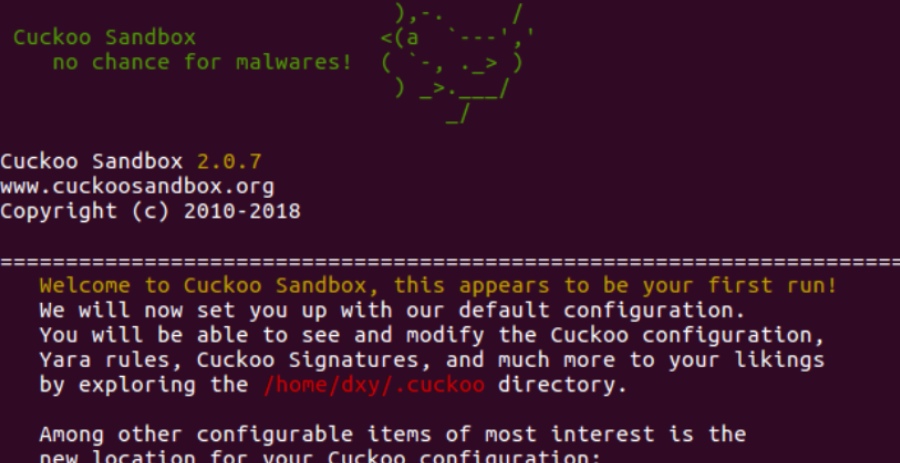